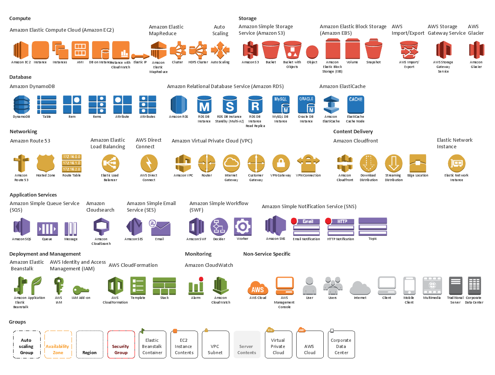
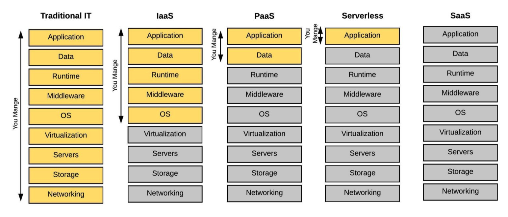

# AWS Certification Prep

## Content

1.  Compute

    - [EC2](https://github.com/BravoChos/aws-saa-certification/tree/master/solutionArchitect/01_compute/01_EC2)
      - [Auto-Scailing-Group](https://github.com/BravoChos/aws-saa-certification/tree/master/solutionArchitect/01_compute/01_EC2/Auto-Scaling-Group)
      - [VM Import/Export](https://github.com/BravoChos/aws-saa-certification/tree/master/solutionArchitect/01_compute/01_EC2/VM%20Import/Export)
    - [ECS](https://github.com/BravoChos/aws-saa-certification/tree/master/solutionArchitect/01_compute/02_ECS)
    - [Lambda](https://github.com/BravoChos/aws-saa-certification/tree/master/solutionArchitect/01_compute/03_Lambda)
    - [ECS](https://github.com/BravoChos/aws-saa-certification/tree/master/solutionArchitect/01_compute/04_ElasticBeanStalk)
    - [ECS](https://github.com/BravoChos/aws-saa-certification/tree/master/solutionArchitect/01_compute/05_LightSail)

2.  Storage

    - [EFS](https://github.com/BravoChos/aws-saa-certification/tree/master/solutionArchitect/02_storage/01_EFS)
    - [EBS](https://github.com/BravoChos/aws-saa-certification/tree/master/solutionArchitect/02_storage/02_EBS)
    - [S3](https://github.com/BravoChos/aws-saa-certification/tree/master/solutionArchitect/02_storage/03_S3)
    - [Glacier](https://github.com/BravoChos/aws-saa-certification/tree/master/solutionArchitect/02_storage/04_Glacier)
    - [Snowball](https://github.com/BravoChos/aws-saa-certification/tree/master/solutionArchitect/02_storage/05_Snowball)
    - [Storage Gateway](https://github.com/BravoChos/aws-saa-certification/tree/master/solutionArchitect/02_storage/06_StorageGateway)
    - [Instance Store](https://github.com/BravoChos/aws-saa-certification/tree/master/solutionArchitect/02_storage/07_Instance_Store)

3.  Database

    - [RDS](https://github.com/BravoChos/aws-saa-certification/tree/master/solutionArchitect/03_database/01_RDS)
    - [Aurora](https://github.com/BravoChos/aws-saa-certification/tree/master/solutionArchitect/03_database/02_Aurora)
    - [DynamoDB](https://github.com/BravoChos/aws-saa-certification/tree/master/solutionArchitect/03_database/03_DynamoDB)
    - [Redshift](https://github.com/BravoChos/aws-saa-certification/tree/master/solutionArchitect/03_database/04_Redshift)
    - [ElasticCache](https://github.com/BravoChos/aws-saa-certification/tree/master/solutionArchitect/03_database/05_ElasticCache)
    - [Neptune](https://github.com/BravoChos/aws-saa-certification/tree/master/solutionArchitect/03_database/06_Neptune)

4.  Networking

    - [VPC](https://github.com/BravoChos/aws-saa-certification/tree/master/solutionArchitect/04_networking/01_VPC)
      - [intro](https://github.com/BravoChos/aws-saa-certification/blob/master/solutionArchitect/04_networking/01_VPC/vpc_intro.md)
      - [component](https://github.com/BravoChos/aws-saa-certification/blob/master/solutionArchitect/04_networking/01_VPC/vpc_component.md)
      - [subnet](https://github.com/BravoChos/aws-saa-certification/blob/master/solutionArchitect/04_networking/01_VPC/vpc_subnet.md)
    - [API Gateway](https://github.com/BravoChos/aws-saa-certification/tree/master/solutionArchitect/04_networking/02_API_Gateway)
    - [Route53](https://github.com/BravoChos/aws-saa-certification/tree/master/solutionArchitect/04_networking/03_Route53)
    - [CloudFront](https://github.com/BravoChos/aws-saa-certification/tree/master/solutionArchitect/04_networking/04_CloudFront)
    - [DirectConnection](https://github.com/BravoChos/aws-saa-certification/tree/master/solutionArchitect/04_networking/05_DirectConnection)
    - [ELB](https://github.com/BravoChos/aws-saa-certification/tree/master/solutionArchitect/04_networking/06_ELB)

5.  Management

    - [CloudFormation](https://github.com/BravoChos/aws-saa-certification/tree/master/solutionArchitect/05_management/01_CloudFormation)
    - [CloudWatch](https://github.com/BravoChos/aws-saa-certification/tree/master/solutionArchitect/05_management/02_CloudWatch)
    - [CloudTrail](https://github.com/BravoChos/aws-saa-certification/tree/master/solutionArchitect/05_management/03_CloudTrail)
    - [OpsWork](https://github.com/BravoChos/aws-saa-certification/tree/master/solutionArchitect/05_management/04_OpsWork)
    - [TrustedAdvisor](https://github.com/BravoChos/aws-saa-certification/tree/master/solutionArchitect/05_management/05_TrustedAdvisor)
    - [AWS Config](https://github.com/BravoChos/aws-saa-certification/tree/master/solutionArchitect/05_management/06_AWS_Config)

6.  Analytics

    - [Elastic Search](https://github.com/BravoChos/aws-saa-certification/tree/master/solutionArchitect/06_analytics/01_Elastic_Search)
    - [Kinesis](https://github.com/BravoChos/aws-saa-certification/tree/master/solutionArchitect/06_analytics/02_Kinesis)
    - [EMR](https://github.com/BravoChos/aws-saa-certification/tree/master/solutionArchitect/06_analytics/03_EMR)
    - [Athena](https://github.com/BravoChos/aws-saa-certification/tree/master/solutionArchitect/06_analytics/04_Athena)

7.  Developer Tools

    - [CodePipeline](https://github.com/BravoChos/aws-saa-certification/tree/master/solutionArchitect/07_developer_tools/01_CodePipeline)
    - [CodeDeploy](https://github.com/BravoChos/aws-saa-certification/tree/master/solutionArchitect/07_developer_tools/02_CodeDeploy)
    - [CodeCommit](https://github.com/BravoChos/aws-saa-certification/tree/master/solutionArchitect/07_developer_tools/03_CodeCommit)

8.  Security
    - [IAM](https://github.com/BravoChos/aws-saa-certification/tree/master/solutionArchitect/08_security/01_IAM)
    - [Cognito](https://github.com/BravoChos/aws-saa-certification/tree/master/solutionArchitect/08_security/02_Cognito)
    - [CertificateManager](https://github.com/BravoChos/aws-saa-certification/tree/master/solutionArchitect/08_security/04_CertificateManager)
    - [KMS](https://github.com/BravoChos/aws-saa-certification/tree/master/solutionArchitect/08_security/05_KMS)
9.  Application
    - [SNS](https://github.com/BravoChos/aws-saa-certification/tree/master/solutionArchitect/09_application/01_SNS)
    - [SQS](https://github.com/BravoChos/aws-saa-certification/tree/master/solutionArchitect/09_application/02_SQS)
      - [advanced](https://github.com/BravoChos/aws-saa-certification/tree/master/solutionArchitect/09_application/02_SQS/advanced)
    - [SWF](https://github.com/BravoChos/aws-saa-certification/tree/master/solutionArchitect/09_application/03_SWF)
    - [STS](https://github.com/BravoChos/aws-saa-certification/tree/master/solutionArchitect/09_application/04_STS)

 

## AWS Services

 

 

## Serverless Level

 

 

## ElasticBeanstalk vs cloudFormation

 

 

## Web Application Hosting

 

 

## AWS VOCA

1. [Compute](https://github.com/BravoChos/aws-saa-certification/tree/master/aws-voca/01_compute)
2. [Storage](https://github.com/BravoChos/aws-saa-certification/tree/master/aws-voca/02_storage)
3. [Database](https://github.com/BravoChos/aws-saa-certification/tree/master/aws-voca/03_database)
4. [Networking](https://github.com/BravoChos/aws-saa-certification/tree/master/aws-voca/04_networking)
5. [Management](https://github.com/BravoChos/aws-saa-certification/tree/master/aws-voca/05_management)
6. [Analytics](https://github.com/BravoChos/aws-saa-certification/tree/master/aws-voca/06_analytics)
