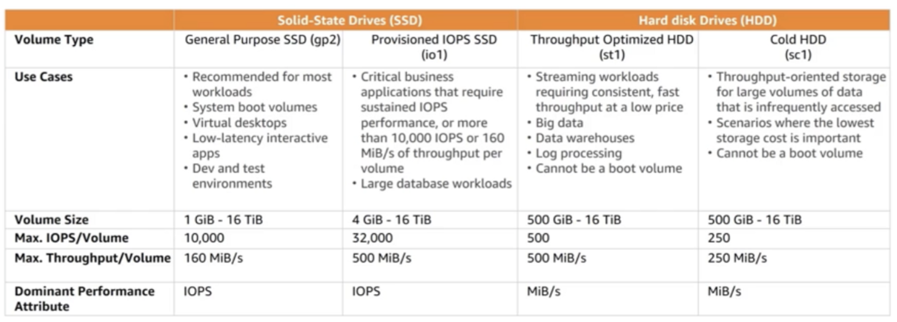

# EC2 Instance Store
- Ephemeral volumes
- Only certain EC2 instances
- Fixed capacity
- Disk type and capacity depends on EC2 instance type
- Application-level durability

# Elastic Block Store
- Different types
- Encryption 
- Snapshot
- Provisioned capacity
- Independent lifecycle than EC2 instance
- Multiple volumes striped to create large volumes

 

</img>

# Amazon EFS
- File storage in the AWS Cloud
- Shared storage
- Petabyte-scale file system
- Elastic capcity
- Supports NFS v4.0 and 4.1 (NFSv4) protocol
- Compatible with Linux-based AMIs for Amazon EC2

 

</img>

# Amazon S3
- Consistency model
- Storage classes & Durability - Standard, Standard-IA
- Encryption (data at rest) - SSE-S3, SSE-KMS, SSE-C
- Encryption (data in transit) - HTTPS
- Versioning
- Access Control 
- Multi-part upload
- Internet-API accessible
- Virtually unlimited capaciry
- Regional Availability
- Highly Durable - 99.99999999%

# Amazon Glacier
- Data backup and archive storage
- Vaults and archives
- Retrievals - expedited, standard, bulk
- Encryption 
- Amazon S3 object lifecycle policy
- Regionally availability
- Highly Durable - 99.99999999%

