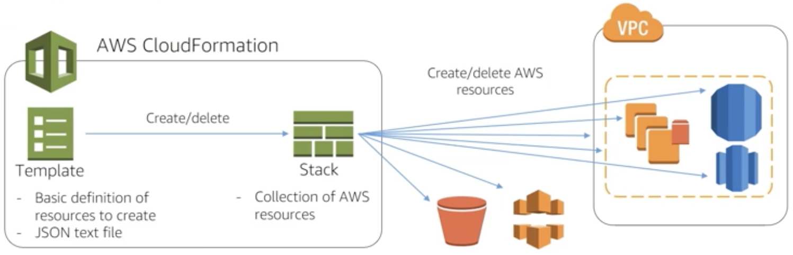

# CloudFormation
- Declarative programming language for deploying AWS resources.
- Uses templates and stacks to provision resources.
- Craete, update, and delete a set of resources as a single unit (stack).
- Templates do not have to be region specific.
- Parameters are for inputs from users; AMI IDs are difficult for users to enter.
- AMI Ids differ accross regions.
- Use mapping to specify the base AMI since AMI IDs are different in each region.

</img>

# AWS Lambda
- Fully managed compute services that run stateless code (Node.js, Java, C#, Go and Python) in response to an event or on a time-based interval.
- Allows you to run code without managing infrastructure like Amazon EC2 instances and Auto Scaling groups.
- lambda does not allow SSH login, write all output to S3