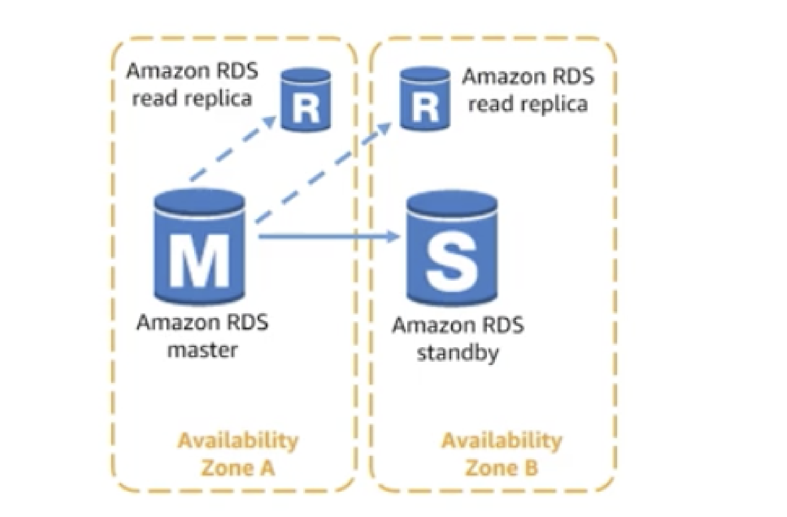

# Amazon Redshift
Use Amazon RDS
- Complex transactions or complex queries
- A medium-to-high query/write rate
- No more than a single worker node/shard
- High Durability

Do not use Amazon RDS
- Massive read/write rates(e.g., 150 K write/second)
- sharding 
- Simple GET/PUT requests and queries
- RDBMS customization

# RDS Read Replicas

# DynamoDB: Provisioned Throughput 

Allocates resources based on throughput capacity requirements (read/write)

- Read capacity unit (for an item up to 4 KB in size)
    - One **strongly** consistent read per second
    - Two eventually consistent reads per second
- Write capacity unit (for an item up to 1 KB in size)
    - One write per second
