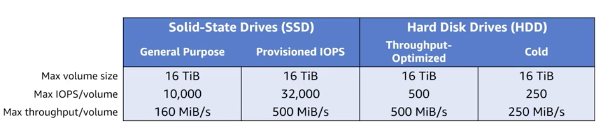

# Amazon EBS Volume types

</img>


# Amazon S3 buckets
To upload your data (photos, videos, documents):
1. Create a bucket in one of the AWS Regions. 
2. Upload any number of objects to the bucket. 

Bucket
````
http://bucket.s3.amazonaws.com
http://bucket.s3-aws-region.amazonaws.com
````

Object
````
https://s3-ap-northeast-1.amazonaws.com/[bucketName]/preview2Key.mp4
````

# Amazon S3: Payment Model
Pay only for what you use 
- GBs per month
- Transfer out of region 
- PUT, COPY, POST, LIST, and GET requests to
Free of charge
- Transfer in to Amazon S3
- Transfer out from Amazon S3 to Amazon CloudFront or the same region

# Amazon S3: Storage Classes
**General purpose**: Amazon S3 Standard
- Highly availability requirements: Use cross-region replication
**Infrequent accessed data**: Amazon S3 Standard - Infrequent Access
- Lower cost per GB stored
- Higher cost per PUT, COPY, POST, or GET request
- 30-day storage minimum

# Lifecycle policies
Amazon S3 lifecycle policies allow you to delete or move objects based on age.