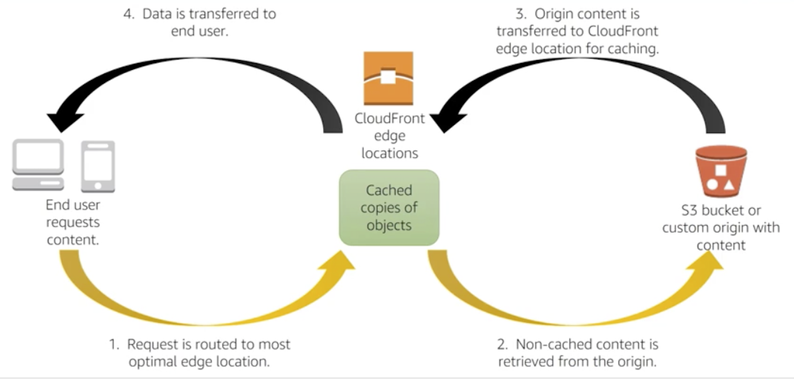

# Caching in CloudFront

- Use case and benefits
- Content - static and dynamic
- Origin - S3, EC2, ELB, HTTP servers
- Protect private content
- Improve security
    - AWS Shield Standard and Advanced
    - AWS WAF
    
# Caching with ElastiCache

Memcached 
- Multithreading
- Low maintenance
- Easy horizontal scalability with Auto Discovery

Redis
- Support for data structures
- Persistence
- Atomic operations
- Pub/Sub messaging
- Read replicas/failover
- Cluster mode/sharded clusters