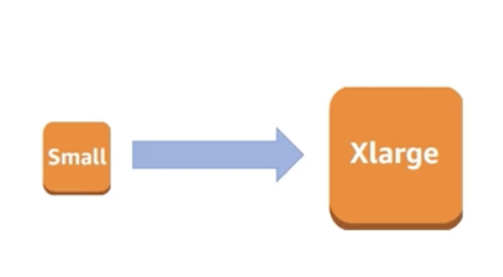
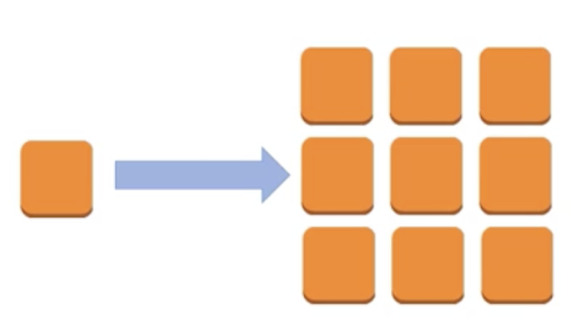
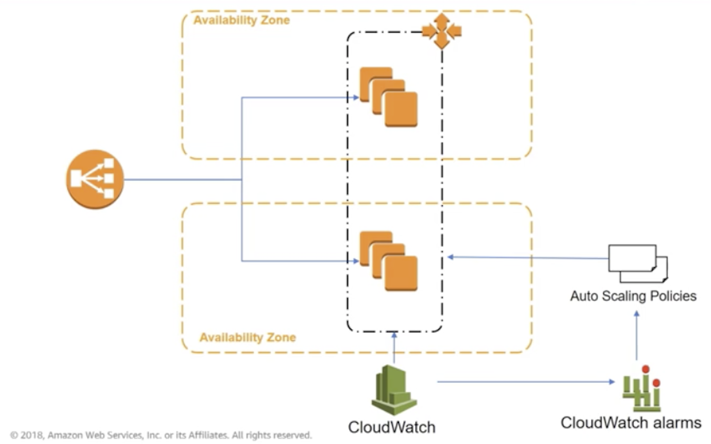

# Vertical Scaling vs. Horizontal scaling
**Vertical scaling (Scale up and down)**  
Change in the specifications of instances (more CPU, memory)

**Horizontal Scaling (Scale in and out)**  
Change in the number of instances (add and remove instances as needed)

# Auto Scaling
- Launch or terminates instances
- Automaticaly register new instances with load balancer
- can launch across Availability Zones

# Implement Elasticity

# Auto Scaling Components
Auto Scaling launch configuration
- specifies EC2 instance size and AMI name

Auto Scaling Group
- References the launch configuration
- specifies min, max, and desired size of the Auto Scaling group
- May reference an ELB instance
- Health Check Type

Auto Scaling Policy
- specifies how much to scale in or scale out the Auto Scaling
- one or more may be attached to Auto Scaling group