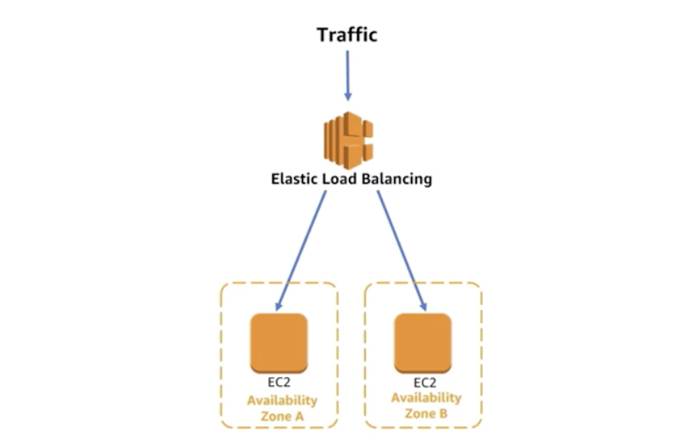

# CloudWatch Metrics
- Know what CloudWatch can monitor
    - CPU 
    - Network
    - Queue size
- Understand CloudWatch Logs 
- Understand the difference between default and custom metrics

# Elastic Load Balancing
