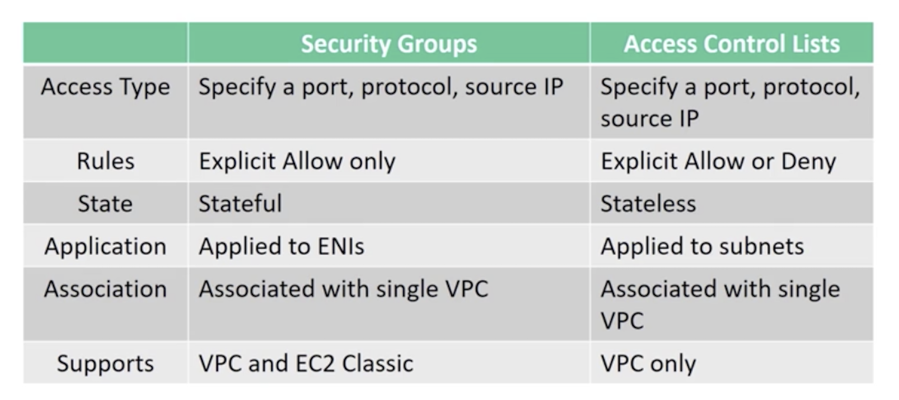
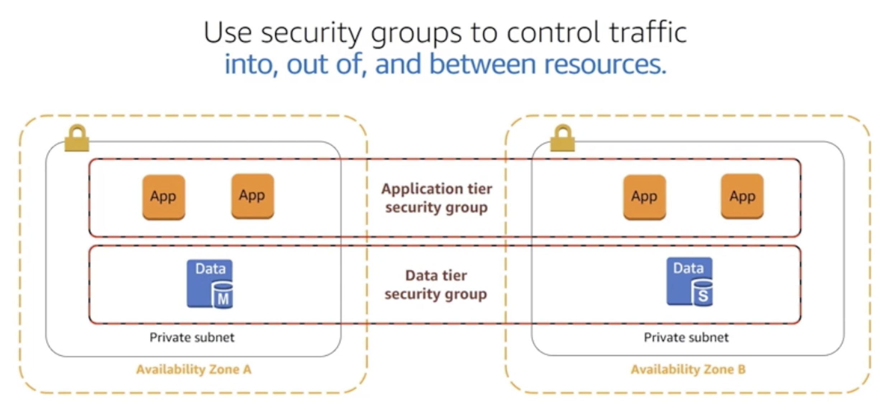
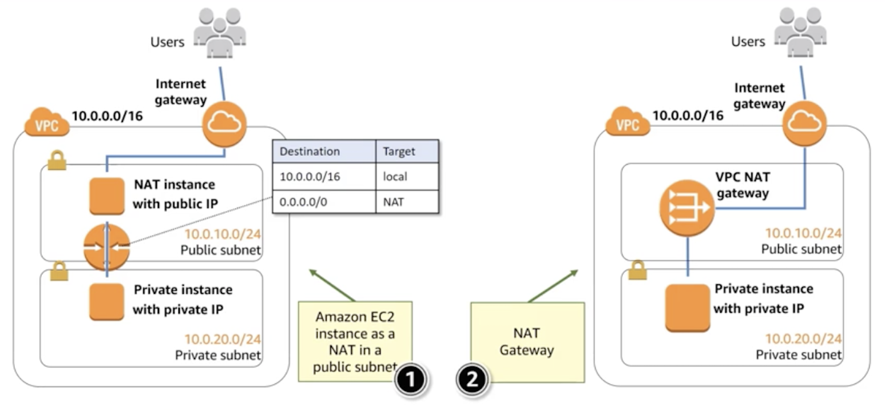

# Compute/Network Architecture
- Virtual Private Cloud (VPC)
- Design your network architecture in the cloud environment
    - Security
    - Routing 
    - Network isolation
    - Management
    - Bastion hosts

# Virtual Private Cloud
- Organizations: Subnets
- Security: Security groups/access control lists
- Network isolation: Internet gateways/virtual private gateways/NAT gateways
- Traffic direction: Routes

# How to Use subnets
**Recommendation**: Use subnetsto define internet accessibility.

**Public subnets**
- To support inboud/outbound access to the public internet, include a routing table entry to an **internet gateway**

**Private subnets**
- Do not have a routing table entry to an internet gateway
- Not directly accessible from the public internet
- To support restricted, outbound-only public internet access, typically use a "jump box" (NAT/proxy/bastion host)

# Security Groups vs. Network ACL

 

# VPC Connections
know the services to get traffic in or out of your VPC instance
- Internet gateway: Connect to the internet
- Virtual private gateway: Connect to VPN
- AWS Direct Connect: Dedicated pipe
- VPC peering: Connect to other VPCs
- NAT gateways: Allow internet traffic from private subnets

# Outbound Traffic From Private Instances
