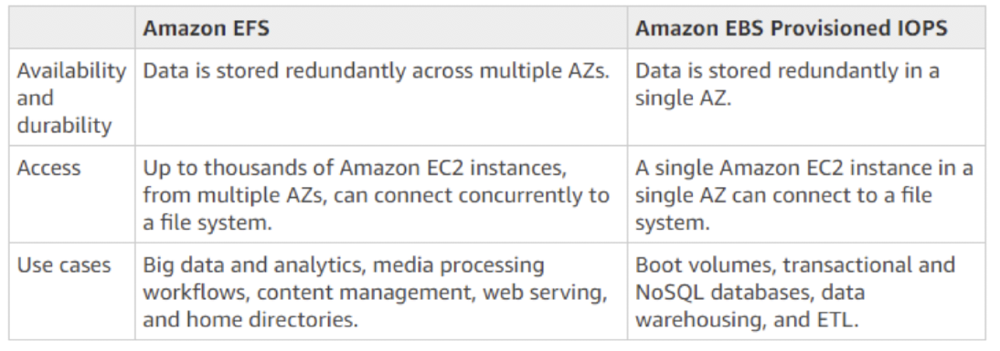

# EFS

**EFS** or Amazon Elastic file system: is network attached storage and it's specifically for Amazon EC2 servers. Because it is network attached store, this allows multiple servers to access one data source in a similar way to NAS on your network at home can be accessed by multiple computers on that network.

## Creating or Deleting Mount Targets in a VPC

To access an Amazon EFS file system in a VPC, you need mount targets. For an Amazon EFS file system, the following is true:

- You can create one mount target in each Availability Zone.
- If the VPC has multiple subnets in an Availability Zone, you can create a mount target in only one of those subnets. All EC2 instances in the Availability Zone can share the single mount target.

**Note**  
We recommend that you create a mount target in each Availability Zones. There are cost considerations for mounting a file system on an EC2 instance in an Availability Zone through a mount target creatd in another Availability Zone.

## Working with VPC Peering in Amazon EFS

A **VPC Peering connection** is a networking connection between two VPCs that enables you to route traffic between them using private internet Protocal version 4 (IPv4) or IPv6 addresses. You can use an Amazon EFS file system in one VPC at a time. That is, you creat mount targets in VPC for your file system, and those mount targets to provide access to the file system from EC2 instances in that VPC.

**Note:**  
port 2049 (NFS) is for EFS security group

**Enable Encryption**
If you enable encryption for your file system, all data on your file system will be encrypted at rest. You can select a KMS key from your account to protect your file system, or you can provide the ARN of a key from a different account. Encryption of data at rest can only be enabled during file system creation. Encryption of data in transit is configured when mounting your file system.

If you want to delete an unencrypted-at-rest file system but want to retain the data, first create a new encrypted-at-rest file system. Next, copy the data over to the new encrypted-at-rest file system. After the data is copied over, you can delete the unecnrypted-at-rest file system.

AWS uses NFS protocol for EFS. NFS is not an encrypted protocol and anyone on the same physical network could sniff the traffic and reassemble the information being passed back and forth.

However, AWS provides an option to encrypt data at transit through NFS to EFS. Encryption during transit is not an option on EFS during or after creation. Amazon EFS mount helper to enable encryption during transit.

# EFS vs EBS

