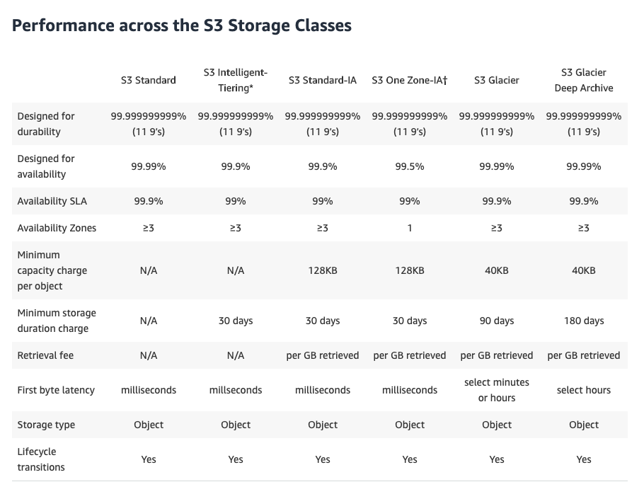
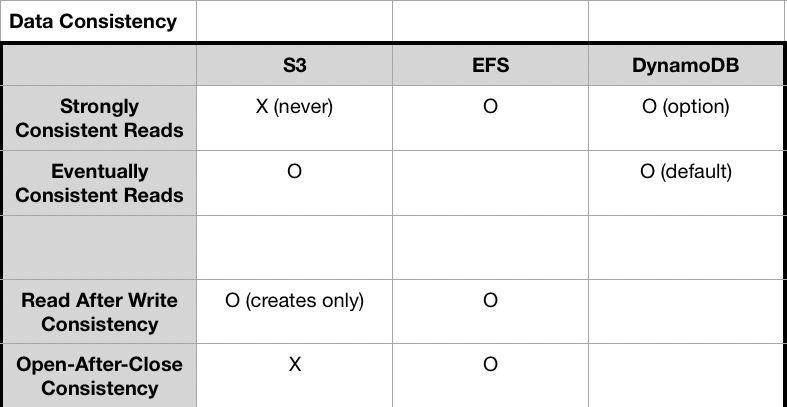
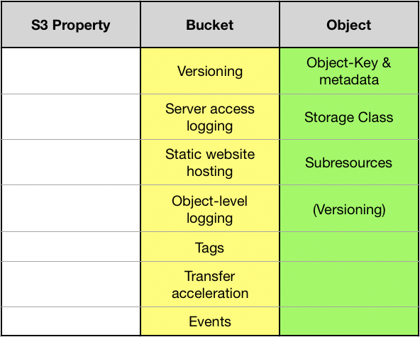

# Amazon S3

**You must explicitly enable versioning on your bucket. By default, versioning is disabled.**

Customers may use mechanisms for controlling access to Amazon S3 resources:
- Identity and Access Management (IAM) policies
- bucket policies
- Access Control Lists (ACLs)
- Query string authentication

**Versioning** is  on the bucket level and can be used to recover prior versions of an object.

## Storage Class

**1)-S3 Standard**  
The S3 **Standard** storage class provides 99.999999999% **Durability** of objects over a given year. It is designed to sustain the concurrent loss of data in two facilities. 

**2)-S3 Standard - IA**  

**3)-GLACIER**  
GLACIER storage class S3 objects are visible and available only through Amazon S3, not through Amazon Glacier. The GLACIER storage class is suitable for archiving data where data access is infrequent. Archived objects are not available for real-time access. You must first restore the objects to S3 before you can access them.

## Data Consistency

**Note:**  
S3 has eventual consistency for overwrite PUT and DELETEs.

**Read-after-write consistency** allows you to retrieve objects immediately after creation in Amazon S3.
Eventually consistent reads can provide higher read throughput than consistent reads.

## Request Rate and Performance Guidelines
Amazon S3 automatically scales to high request rates. For example, your application can achieve at least 3,500 PUT/POST/DELETE and 5,500 GET requests per second per prefix in a bucket. There are no limits to the number of prefixes in a bucket.

## Uploading objects
Depending on the size of the data you are uploading, Amazon S3 offers the following options:
- Upload object in a single operation: with a single PUT operation, you can upload objects up to 5GB in size. 
- Upload objects in parts: using the multipart upload API, you can upload large objects. You can upload objects in parts. You can use a multipart upload for objects from 5 MB to 5TB in size.

Using multipart upload provides the following advantage:
• Improved throughput
• Quick recovery from any network issues
• Pause and resume object uploads
• Begin an upload before you know the final object size

In general, when your object size reaches **100 MB**, you should consider using multipart uploads instead of uploading the object in a single operation.

With a single PUT operation, you can only upload objects **up to 5 GB in size**. Using the **multipart upload API**, you can upload large objects, up to 5 TB. The multipart upload API is designed to improve the upload experience for larger objects. You can upload objects in parts. These object parts can be uploaded independently, in any order, and in parallel. You can use a multipart upload for objects from **5 MB to 5 TB in size**.

## Retrieval Options
The access time of your request depends on the **retrieval option** you choose: Expedited, Standard, or Bulk retrievals.

- **Expedited retrievals** are typically made available within **1 – 5 minutes**. 
- **Standard retrievals** typically complete between **3 – 5 hours**. 
- **Bulk retrievals** typically complete within **5 – 12 hours**.

## S3 Property

**1)-Buckets**  

By default, you can **create up to 100 buckets** in each of your AWS accounts. If you need additional buckets, you can increase your bucket limit by submitting a service limit increase.

Amazon S3 bucket names are **globally unique**, regardless of the AWS region in which you create the bucket.

There is no limit to the number of objects that can be stored in a bucket and no difference in performance whether you use many buckets or just a few. Amazon S3 is cloud storage for the Internet. To upload your data (photos, videos, documents etc.), you first create a bucket in one of the AWS Regions. You can then upload any number of objects to the bucket.

**2)-Object**  
**Objects** consist of object data and metadata. The data portion is opaque to Amazon S3. The **metadata** is a set of name-value pairs that describe the object. These include some default metadata, such as the date last modified, and standard HTTP metadata, such as Content-Type. You can also specify custom metadata at the time the object is stored.

Every object in Amazon S3 can be uniquely addressed through the combination of the web service endpoint, bucket name, key, and optionally, a version but **not region**. 

## Pricing
Amazon S3 charges you only for what you actually use, with no hidden fees and no overage charges. This gives developers a variable-cost service that can grow with their business while enjoying the cost advantages of Amazon's infrastructure.

**There is no additional charge for hosting static websites on Amazon S3**. The same pricing dimensions of storage, requests, and data transfer apply to your website objects. 

We charge less where our costs are less. Some prices vary across Amazon S3 Regions and are based on the location of your bucket.

## Permission & Policy
Unlike access control lists, which can add (grant) **permissions** only on individual objects, **policies** can either add or deny permissions across all (or a subset) of objects within a bucket.

Using IAM, you can create IAM users, groups, and roles in your account and attach access policies to them granting them access to AWS resources including Amazon S3.

Bucket policy and user policy are two of the access policy options available for you to grant permission to your Amazon S3 resources. Both use JSON-based access policy language.

policy contains the following elements:
- Resources 
- Actions
- Effect
- Principal

A pre-signed URL gives you access to the object identified in the URL, provided that the creator of the pre-signed URL has permissions to access that object. That is, if you receive a pre-signed URL to upload an object, you can upload the object only if the creator of the pre-signed URL has the necessary permissions to upload that object.

