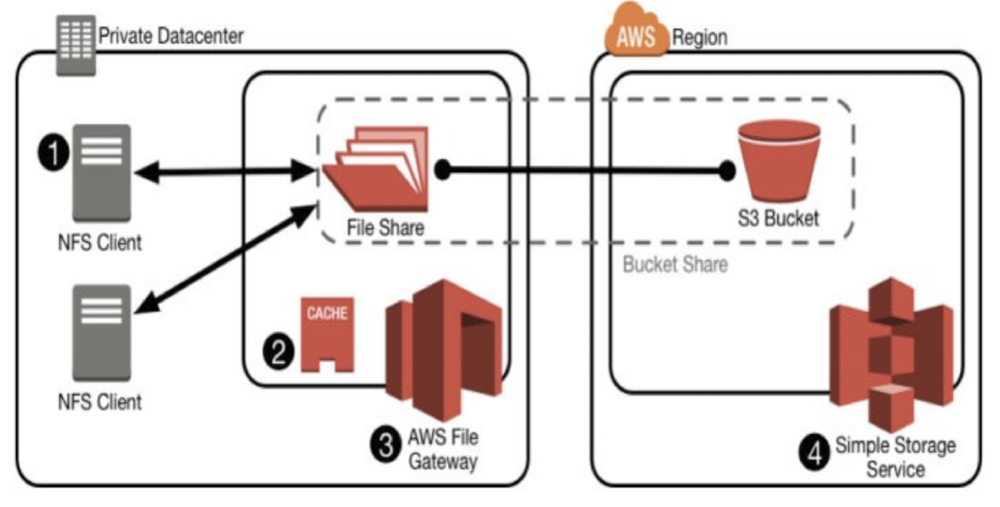

# Amazon Storage Gateway
**The AWS Storage Gateway**: enables hybrid storage between on-premise environments and the AWS cloud. It provides a low latency performance by caching frequently used data on-premises while storing the less frequently data in Amazon Cloud storage services. 

AWS Storage Gateway offers file-based, volume-based, and tape-based storage solutions:

## File Gateway 

A file gateway supports a file interface into Amazon Simple Storage Service (Amazon S3) and combines a service and a virtual software appliance. By using this combination, you can store and retrieve objects in Amazon S3 using industry-standard file protocols such as Network File System (NFS) and Server Message Block (SMB). The software appliance, or gateway, is deployed into your on-premises environment as a virtual machine (VM) running on VMware ESXi or Microsoft Hyper-V hypervisor. The gateway provides access to objects in S3 as files or file share mount points. With a file gateway, you can do the following:

You can access your data directly in Amazon S3 from any AWS Cloud application or service.

You can manage your Amazon S3 data using lifecycle policies, cross-region replication, and versioning. You can think of a file gateway as a file system mount on S3.

A file gateway simplifies file storage in Amazon S3, integrates to existing applications through industry-standard file system protocols, and provides a cost-effective alternative to on-premises storage. It also provides low-latency access to data through transparent local caching. A file gateway manages data transfer to and from AWS, buffers applications from network congestion, optimizes and streams data in parallel, and manages bandwidth consumption. File gateways integrate with AWS services, for example with the following:

- Common access management using AWS Identity and Access Management (IAM)
- Encryption using AWS Key Management Service (AWS KMS)
- Monitoring using Amazon CloudWatch (CloudWatch)
- Audit using AWS CloudTrail (CloudTrail)
- Operations using the AWS Management Console and AWS Command Line Interface (AWS CLI)
- Billing and cost management

## Volume Gateway 
A volume gateway provides cloud-backed storage volumes that you can mount as Internet Small Computer System Interface (iSCSI) devices from your on-premises application servers.

The volume gateway is deployed into your on-premises environment as a VM runnning on VMware ESXi or Microsoft Hyper-V hypervisor.

The gateway supports the following volume configurations:

- **Cached volumes** – You store your data in Amazon Simple Storage Service (Amazon S3) and retain a copy of frequently accessed data subsets locally. Cached volumes offer a substantial cost savings on primary storage and minimize the need to scale your storage on-premises. You also retain low-latency access to your frequently accessed data.

- **Stored volumes** – If you need low-latency access to your entire dataset, first configure your on-premises gateway to store all your data locally. Then asynchronously back up point-in-time snapshots of this data to Amazon S3. This configuration provides durable and inexpensive offsite backups that you can recover to your local data center or Amazon EC2. For example, if you need replacement capacity for disaster recovery, you can recover the backups to Amazon EC2.

## Tape Gateway 
A tape gateway provides cloud-backed virtual tape storage. The tape gateway is deployed into your on-premises environment as a VM runnning on VMware ESXi or Microsoft Hyper-V hypervisor.

With a tape gateway, you can cost-effectively and durably archive backup data in GLACIER or DEEP_ARCHIVE. A tape gateway provides a virtual tape infrastructure that scales seamlessly with your business needs and eliminates the operational burden of provisioning, scaling, and maintaining a physical tape infrastructure.
