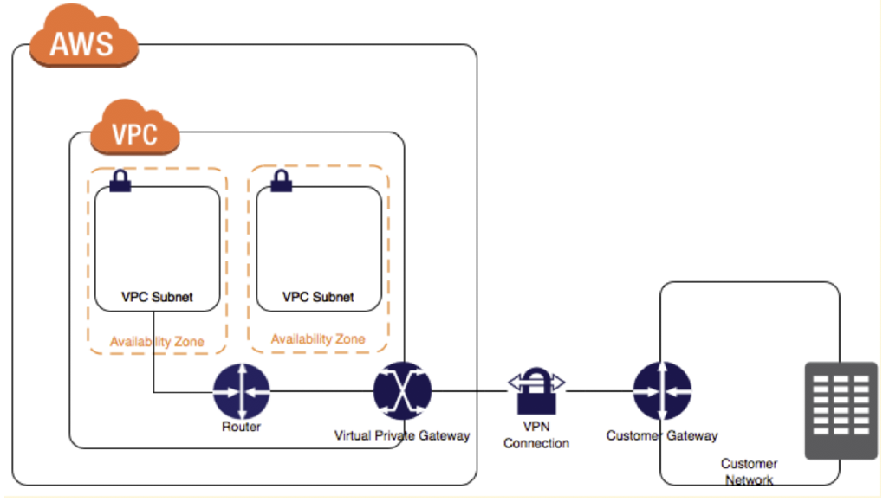
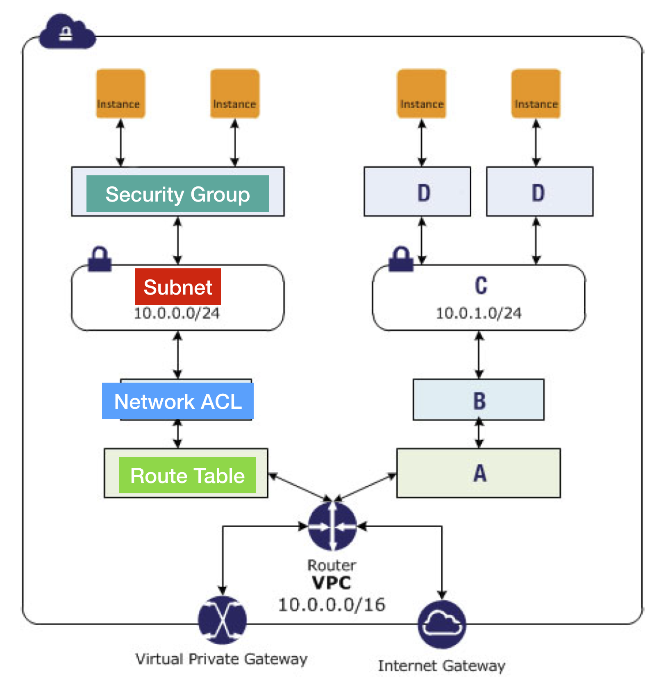

# VPC

**VPC** or Amazon virtual private cloud for short lets you provision a logically isolated section of the AWS cloud and you can launch AWS resources in that virtual network that you yourself define and this is your own personal private space within the AWS cloud and no one can enter it unless you allow them to enter it.

## VPC Endpoints

A VPC endpoint enables you to privately connect your VPC to supported AWS services and VPC endpoint services powered by AWS **PrivateLink** without requiring an internet gateway, NAT device, VPN connection, or AWS Direct Connect connection. Instances in your VPC do not require public IP addresses to communicate with resources in the service. Traffic between your VPC and the other service does not leave the Amazon network.

### 1. Interface Endpoint

**Interface Endpoint** (Powered by AWS PrivateLink): is an elastic network interface with a private IP address from the IP address range of your subnet that serves as an entry point for traffic destined to a supported service. The following services are supported:

- Amazon API Gateway
- Amazon EC2 Auto Scaling
- AWS CloudTrail
- AWS CloudWatch
- Amazon Kinesis
- Amazon SNS, SQS

### 2. Gateway Endpoint

**Gateway Endpoint** is a gateway that you specify as a target for a route in your route table for traffic destined to a supported AWS service. The following AWS services are supported:

- S3
- DynamoDB

### 3. Controlling the Use of VPC Endpoints

By default, IAM users do not have permission to work with endpoints. You can create an IAM user policy that grants users the permissions to create, modify, describe, and delete endpoints.

## VPC Peering

A VPC peering connection is a networking connection between two VPCs that enables you to route traffic between them privately. Instances in either VPC can communicate with each other as if they are within the same network. You can create a VPC peering connection between your own VPCs, with a VPC in another AWS account, or with a VPC in a different AWS Region.

**To create a VPC peering connection**, first create a request to peer with another VPC. You can request a VPC peering connection with another VPC in your account, or with a VPC in a different AWS account. For an inter-region VPC peering connection where the VPCs are in different regions, the request must be made from the region of the requester VPC.

**To activate the request**, the owner of the accepter VPC must accept the request. For an inter-region VPC peering connection, the request must be accepted in the region of the accepter VPC.

Do not accept VPC peering connections from unknown AWS accounts. A malicious user may have sent you a VPC peering connection request to gain unauthorized network access to your VPC. This is known as **peer phishing**. You can safely reject unwanted VPC peering connection requests without any risk of the requester gaining access to any information about your AWS account or your VPC. You can also ignore the request and let it expire; by default, requests expire after 7 days.

You cannot create a VPC peering connection between VPCs with matching or **overlapping IPv4 CIDR blocks**. This limitation also applies to VPCs that have non-overlapping IPv6 CIDR blocks.

## VPN Connections

 

You can create an IPsec VPN connection between your VPC and your remote network. On the AWS side of the VPN connection, a virtual private gateway **provides two VPN endpoints** (tunnels) for automatic failover. You configure your customer gateway on the remote side of the VPN connection.

AWS recommends that you use **BGP-capable** VPN devices when available, because the BGP protocol offers **robust liveness detection checks** that can assist failover to the second VPN tunnel if the first tunnel goes down. Devices that don't support BGP may also perform health checks to assist failover to the second tunnel when needed.

A VPN connection has two tunnels to help ensure connectivity in case one of the VPN connections becomes unavailable. To protect against a loss of connectivity in case your customer gateway becomes unavailable, you can set up a second VPN connection to your VPC by using a second customer gateway.

## VPC Security

1. Security groups

   - Firewall at the instance level
   - Statefull

2. Network access control lists (ACLs)

   - Firewall at the subnet level
   - Network ACLs as a second layer of defense
   - Stateless

3. Flow logs
   - Capture inforamtion about the IP traffic going to and from network interfaces in you VPC.
   - Flow log data is stored using Amazon CloudWatch logs

You can secure your VPC instances using only security groups; however, you can add network ACLs as a second layer of defense.

 

### 1. Security Group

A **security group** acts as a virtual firewall for your instance to control inbound and outbound traffic. When you launch an instance in a VPC, you can assign up to five security groups to the instance. Security groups act at the **instance** level, not the subnet level. Therefore, each instance in a subnet in your VPC could be assigned to a different set of security groups. If you don't specify a particular group at launch time, the instance is automatically assigned to the default security group for the VPC.

Security groups **are stateful** — if you send a request from your instance, the response traffic for that request is allowed to flow in regardless of inbound security group rules. **Responses to inbound traffic allowed by security group rules are allowed to flow outbound regardless of outbound rules**

Security Group **can specify allow rules, but not deny rules**. Security Group applies to an instance **only if someone specifies** the security group when launching the instance, or associates the security group with the instance later on.

By default, a security group includes an outbound rule that allows all outbound traffic. You can remove the rule and add outbound rules that allow specific outbound traffic only. If your security group has no outbound rules, no outbound traffic originating from your instance is allowed.

### 2. NACL

**Network ACL** operate at the **Subnet** level. A network access control list (ACL) is an optional layer of security for your VPC that acts as a firewall for controlling traffic in and out of one or more subnets. You might set up network ACLs with rules similar to your security groups in order to add an additional layer of security to your VPC.

Network ACL **Is stateless: Return traffic must be explicitly allowed by rules** and responses to allowed inbound traffic are subject to the rules for outbound traffic (and vice versa).

The default network ACL is configured to allow all traffic to flow in and out of the subnets to which it is associated. Each network ACL also includes a rule whose rule number is an **asterisk**. **This rule ensures that if a packet doesn't match any of the other numbered rules, it's denied. You can't modify or remove this rule**.

# Pricing

There are no additional charges for creating and using the VPC itself. Usage charges for other Amazon Web Services, including Amazon EC2, still apply at published rates for those resources, including data transfer charges. If you connect your VPC to your corporate datacenter using the optional hardware **VPN connection**, pricing is per VPN connection-hour (the amount of time you have a VPN connection in the "available" state.) Partial hours are billed as full hours. Data transferred over VPN connections will be charged at standard AWS Data Transfer rates.

## Amazon VPC Limits

Default maximum VPCs per region are **5**.
Maximum subnets per VPC are **200**.
Maximum VPN connections per region **50**
