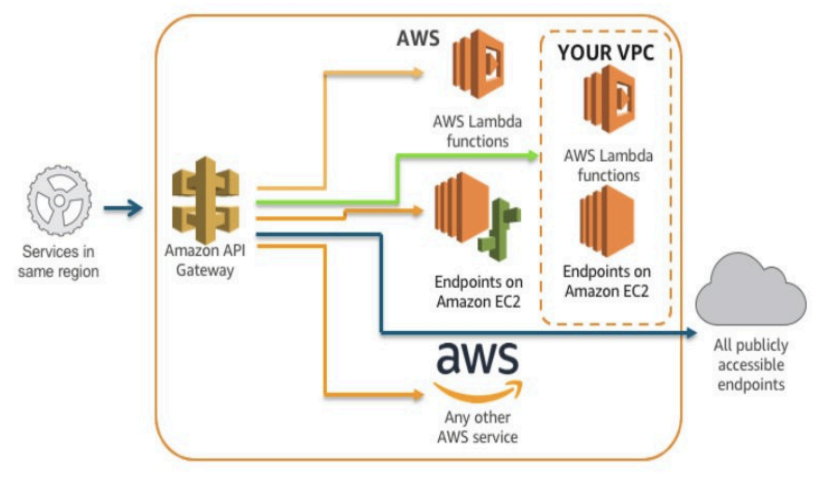

# Amazon API Gateway

Amazon API gateway is a fully managed service that makes it easy for developers to create and deploy secure application programming interfaces or api's at any scale and acts as a secure "front door" for applications to access data, business logic, or functionality from your back-end services. It handles all of the tasks involved in accepting and processing up to hundreds of thousands of concurrent API calls.

Amazon API Gateway can execute

- AWS Lambda functions in your acount
- start AWS Step Functions state machines
- call HTTP endpoints hosted on AWS Elastic Beanstalk
- **non-AWS hosted HTTP based operations that are accessible via the public internet**

 

 

## Integration Type

- Lambda function
- HTTP service
- MOCK
- AWS Service
- VPC Link

AWS API gateway can connect to AWS services which will make proxy calls only to their respective AWS APIs. Tahere is no integration type for database connections directly from API Gateway. You can use Lambda function to connect with database and make lambda as integration type for API Gateway.

Enpoint integrations inside a private VPC. With this capability, you can now have your backend running on EC2 be private inside your VPC without the need for a public accessible IP address or load balancer. **Beyont that, you can also now use API Gateway to fron APIs hosted by backends that exist privately in your own data centers, using AWS Direct Connect links to your VPC.** Private integrations were made possible via VPC Link and Network Load Balancer, which support backends such as EC2 instances, Auto Scaling groups, and Amazon ECS using the Fargate launch type.

## Performance Bottleneck and Improving the API performance

- Enable throttling and control the number of requests per second.
- Enable API caching to serve frequently requested data from API cache.

Note!  
We can improve performance by increasing the capacity of backend systems if above settings does not help. **Simply adding a load balancer does not improve any performance.**

## Throttling

To prevent your API from being overwhelmed by too many requests, Amazon API Gateway throttles requests to your API using the token bucket algorithm, where a token counts for a request. Specifically, API Gateway sets a limit on a steady-state rate and burst of request submissions and burst of request submissions against all APIs in your account. In the token bucket algorithm, the burst is the maximum bucket size.

By default, API Gateway limits the steady-state request rate to 10,000 requests per second (rps). It limits the burst to 5,000 requests across all APIs within an AWS account. You

If the caller sends 10,000 requests in the first miliseconds, API Gateway serves 5,000 of those requests and throttles the rest in the one-second period.

## Controlling Access to an API in API Gateway

API Gateway supports multiple mechanisms for controlling access to your API:

- Resource policies (JSON policy document)
- Standard AWS IAM roles and policies
- Cross-origin resource sharing (CORS)
- Lambda Authorizers
- Amazon Cognito user pools
- Client-side SSL certificates
- Usage plans

Further, Amazon API Gateway automatically protects your back-end systems from distributed denial-of-service (DDoS) attacks, whether attacked with counterfeit requests (Layer 7) or SYN floods (Layer 3).

## Cache settings

When enabling API caching for API Gateway, cache settings are

- Flush entire cache
- Cache capacity
- Encrypt cache data with
