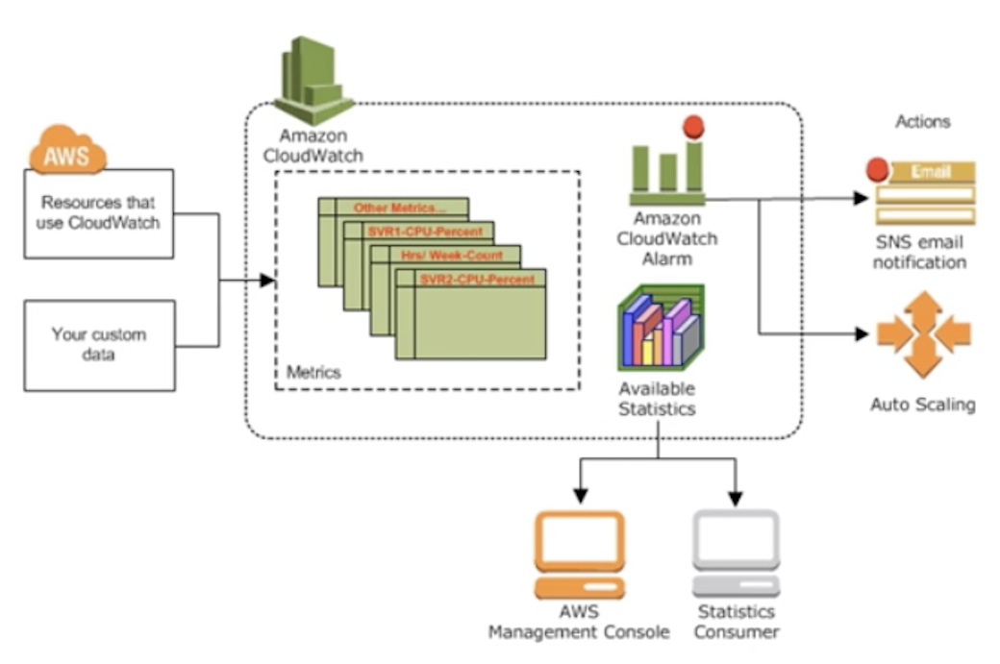

# CloudWatch
**AWS CloudWatch**: is a monitoring service for AWS cloud resources and applications that are deployed on the AWS cloud. It can be used for triggering scaling operations or it can also be used for providing insight into your deployed resources. 

Metrics produced by AWS services are standard resolution (1 minute) by default. Only custom metrics that you define with a storage resolution of 1 second support sub-minute periods. Basic Monitoring metrics (at 5 minute frequency) for Amazon EC2 instances are free of charge, as are all metrics for Amazon EBS volumes, Elastic Load Balancers, and Amazon RDS DB instances.  

